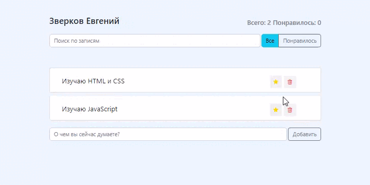

# Twit mini

**Функционал проекта**:  
- Добаваление/удаление твитов 
- Добавление в избранное 
- Лайк твита 
- Поиск по твитам 
- Фильтры

**Используемые технологии**: 
- HTML 
- CSS 
- JavaScript 
- React

**Изображение**: 

